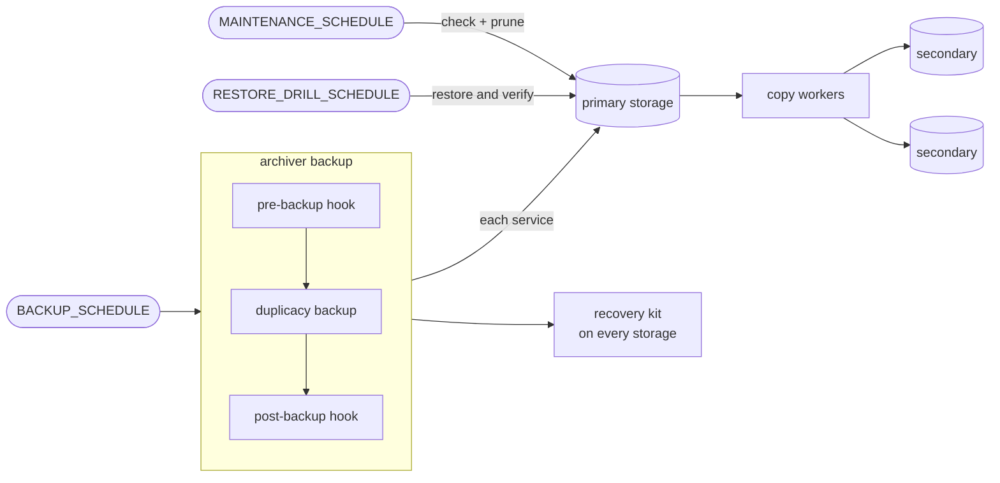

# Archiver

<p>
  
  Automated, encrypted, deduplicated backups of your services' directories to local disk and every storage <a href="https://github.com/gilbertchen/duplicacy/tree/v3.2.5">Duplicacy 3.2.5</a> supports: SFTP, BackBlaze B2, S3 and its kin, Azure, Google Cloud Storage and Drive, OneDrive, Dropbox, WebDAV, SMB, Storj and more. It follows the <a href="https://www.backblaze.com/blog/the-3-2-1-backup-strategy/">3-2-1 backup strategy</a> without the manual configuration.
</p>

> **Primary repository**: This project is developed at [forgejo.bryantserver.com/SisyphusMD/archiver](https://forgejo.bryantserver.com/SisyphusMD/archiver). The GitHub copy is a read-only mirror.

## What is Archiver?

Archiver backs up directories on a schedule to a primary storage, and keeps copies of it on any number of others. You configure it once, as a container: environment variables for settings, files for secrets.

Each directory (a service: an app's data, a database's dumps) is backed up on its own, with optional hooks around it, such as a database dump before and a restart after. Backups are encrypted at rest with your RSA key and deduplicated across every service, so unchanged data is stored once.

## Features

- **Encrypted and deduplicated:** block-level deduplication, RSA encryption, retention you choose (one a day for a week, one a week for a month, and so on).
- **Any storage, copied in the background:** every Duplicacy storage type; each secondary has its own copy worker that retries until it catches up and mirrors the primary's retention, with optional upload limits and copy windows.
- **Hooks:** per-service `pre-backup`, `post-backup` and `post-restore` executables and a `filters` file.
- **Restores you can trust:** an interactive restore that previews what it changes, unattended restores for scripts and Kubernetes, scheduled restore drills that prove revisions come back, and `archiver doctor` to check a whole deployment.
- **Disaster recovery:** an encrypted recovery kit of the whole configuration on every storage, a printable break-glass envelope, and `archiver recover` to rebuild a lost host.
- **Watching it:** backup health (OK, DEGRADED, FAILING), a status page, Prometheus metrics, check-ins for a dead man's switch, and notifications to Pushover, Apprise and ntfy, one per incident.
- **Resilient:** an interrupted backup (a restart, a crash, a power cut) finishes its hooks and runs again when the container comes back, from where Duplicacy left off.
- **Signed images,** with an SBOM and provenance, in a full and a slim variant.

## How it works



A backup runs each service's hooks and its Duplicacy backup to the primary, a few services at a time, then refreshes the recovery kit and wakes the copy workers. Each worker copies what its secondary lacks, retries on its own schedule when the storage is down, and once caught up deletes there what the primary's retention pruned and checks the copy. Maintenance checks and prunes the primary on its own schedule, alongside backups, and restore drills restore real revisions to prove they come back.

## Quick start

You need a container runtime (Docker, Podman or Kubernetes) and at least one place to store backups; [Storage](docs/storage.md) shows how to prepare each kind.

**1. Generate the configuration.** `init` asks what to back up and where, creates the keys, and writes everything to `archiver-setup/env-native/`: `archiver.env` (settings) and `secrets/` (one file per secret and key). It also shows the **recovery password**: save it in your password manager, it recovers everything.

```bash
docker run -it --rm \
  -v ./archiver-setup:/opt/archiver/setup \
  forgejo.bryantserver.com/sisyphusmd/archiver:0.11.1 init
```

**2. Run it.** Put `archiver.env` next to the shipped [compose.yaml](compose.yaml), move the secret files to `./secrets/`, adjust the volumes (the directories to back up, the storage) and the schedules, and start it:

```bash
docker compose up -d
docker exec archiver archiver doctor   # checks configuration, secrets, storages and hooks
```

**3. Take the first backup and look at it.**

```bash
docker exec archiver archiver backup
docker exec archiver archiver status
```

From now on backups run on `BACKUP_SCHEDULE`. Next: print the [break-glass envelope](docs/recovery.md#break-glass-envelope), set up [notifications](docs/configuring.md#notifications), and turn on [restore drills](docs/maintenance.md#restore-drills).

## Documentation

| Guide | What it covers |
|---|---|
| [Installation](docs/installation.md) | The compose file, capabilities and host sockets, graceful shutdown and interrupted runs, container modes, image tags and verifying them |
| [Configuring](docs/configuring.md) | Where settings and secrets come from, service directories, performance, notifications |
| [Configuration reference](docs/configuration.md) | Every setting, generated from the code (and [a JSON schema](docs/archiver.schema.json) of it) |
| [Storage](docs/storage.md) | Preparing storages, storage targets and every type, copies to secondaries, upload limits and copy windows, outages |
| [Hooks](docs/hooks.md) | `pre-backup`, `post-backup`, `post-restore`, `filters`, who may change a hook |
| [Restoring](docs/restore.md) | Interactive, temporary-container and unattended restores |
| [Disaster recovery](docs/recovery.md) | The recovery kit, the break-glass envelope, recovering a lost host |
| [Maintenance](docs/maintenance.md) | Check and prune, mirroring to secondaries, `archiver doctor`, restore drills |
| [Monitoring](docs/monitoring.md) | Backup health, the status page, check-ins, metrics |
| [Commands](docs/commands.md) | Every command, shell completions, running from an external scheduler |
| [Upgrading](docs/upgrading.md) | Upgrading to 1.0, from a bundle, from a host installation |

Older guides: [editing the configuration](docs/guides/configuration/editing-config.md), [local storage](docs/guides/configuration/local-storage-setup.md), [SSH keys](docs/guides/configuration/ssh-key-management.md), [legacy to Docker](docs/guides/migration/legacy-to-docker.md), [uninstalling a legacy installation](docs/guides/maintenance/uninstall-legacy.md). Design decisions are recorded in [docs/adr](docs/adr).

## Licensing


Archiver is free and open-source software licensed under [GNU AGPL-3.0](LICENSE).

Archiver uses the [Duplicacy CLI v3.2.5](https://github.com/gilbertchen/duplicacy/tree/v3.2.5) binary as an external tool. Duplicacy is licensed separately under [its own terms](https://github.com/gilbertchen/duplicacy/blob/v3.2.5/LICENSE.md):

- **Free for personal use** and **commercial trials**
- **Requires a CLI license** for non-trial commercial use ($50/computer/year from [duplicacy.com](https://duplicacy.com/buy.html))

**What counts as commercial use?** Backing up files related to employment or for-profit activities.

**Note:** Restore and management operations (restore, check, copy, prune) never require a license. Only the `backup` command requires a license for commercial use.

If you're using Archiver commercially, please purchase a Duplicacy CLI license to support the project that makes this tool possible

